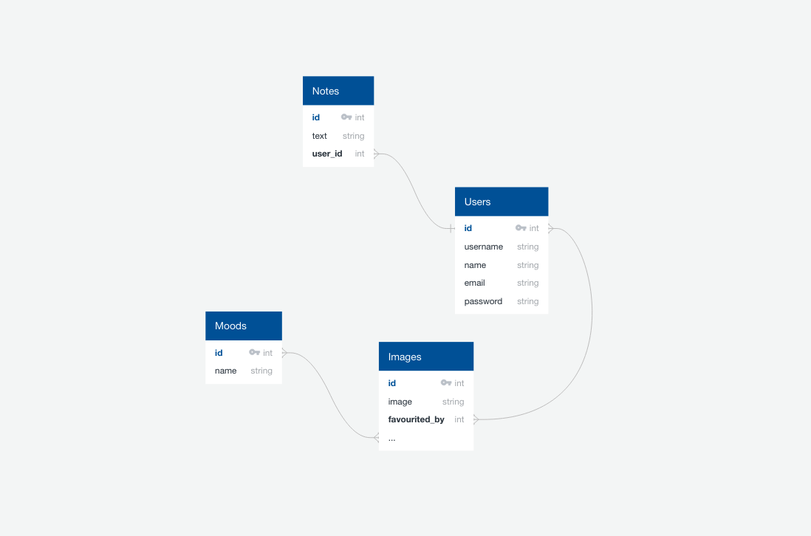
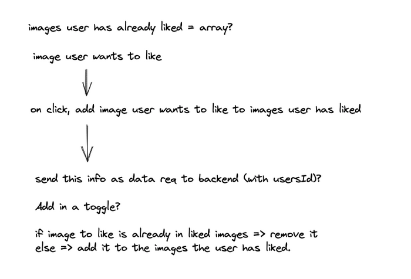
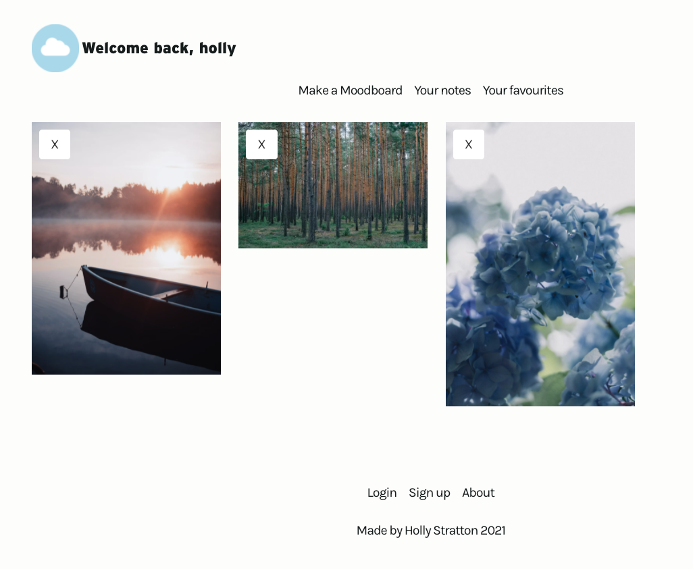

# Mood.ible

A solo coding project by Holly Stratton (7 days) 

## Deployment 

This project was deployed using Netlify and Heroku and can be [found here.](https://moodible-app.netlify.app/)

### Getting started

* Clone or download repository for [frontend](https://github.com/hollylouisarose/project-four-frontend) and [backend](https://github.com/hollylouisarose/project-four-backend) of mood.ible.

For frontend:
* `npm i` to install frontend dependencies.
* `npm run start` or `npm run dev`  to run the development server.
* `npm run build` to create a build directory.

For backend:

* `pipenv` to install Python packages.
* `python manage.py loaddata images/seeds.json` to seed images data.
* `python manage.py runserver` to start the app.

## Overview 

For this project, the brief was to create a multiple page app with CRUD functionality, using a React.js frontend and a Django/Python backend. Inspired by sites like Pinterest and Unsplash, Moodible generates a moodboard of images for the user, based on one of three moods: calm, playful or adventurous. 

To avoid information overwhelm, the app only shows the user five images at a time. Users can save their favourite images to their private profile. Their private profile also has a space for note taking where they can write down ideas for later.

Moodible is my attempt to prototype a one stop shop for cultivated inspiration. 

### App walk through


## Approach

In the planning phase, I realised Moodible presented several coding challenges: 

* Manipulating my image data to show only five, randomly selected images at a time.
* Liking and unliking images.
* User permissions, ensuring the user's profile is not visible to other users.



I started by mapping out my database models. Moodible required a mixture of one to many and many to many relationships:
Initially, I thought the many to many relationships were:
* The users and images.
* The images and the image moods. 

And the notes and users were a one to many relationship.

Having established my database relationships and models, I set about putting together a basic design and planning my code. I spent two and half days on my backend and the remaining days on my frontend.

On a previous project, I had encountered challenges performing image liking, so I experimented with writing some pseudocode to help myself.



## The Build

## Challenges

When building Moodible, I encountered three main coding challenges:
* Adjusting my image model.
* Setting the moodboard’s random images.
* Liking and unliking images, without having to visit an image show page.

### Adjusting my image model

While building my backend, I realised that I did not want an image to be able to have more than one mood. It ran the risk of it appearing more than once, which undermined the user experience which promised the user a fresh relationship each time.

I updated the image and image mood to be a one to many relationship and stored the mood as a foreign key: 

``` python
class Mood(models.Model):
    MOOD_CHOICES = [
      ('Calm', 'Calm'),
      ('Playful', 'Playful'),
      ('Adventurous', 'Adventurous'),
    ]
    choice = models.CharField(max_length=20, choices=MOOD_CHOICES)

    def __str__(self):
        return f'{self.choice}'

class Image(models.Model):
    ORIENTATION_CHOICES = [
      ('Portrait', 'Portrait'),
      ('Landscape', 'Landscape'),
    ]
    orientation = models.CharField(max_length=20, choices=ORIENTATION_CHOICES)
    source = models.CharField(max_length=200)
    description = models.CharField(max_length=100)
    mood = models.ForeignKey(Mood, related_name='moods', on_delete=models.CASCADE)
    liked_by = models.ManyToManyField(
      'jwt_auth.User',
      related_name='liked_images',
      blank=True
    )

    def __str__(self):
        return f'{self.description}'
```
This presented an interesting challenge as I had already migrated my image model, so it was excellent practice in resetting a Postgres database with Django and handling migrations.

### Setting the moodboard’s random images

This project was my first experience in more complex limiting of the data I display out of an API. I broke this process down into three steps:

* Filter the images based on the mood the user selected on the mood choices page.
* Limit that selection of images to 5.
* Generate a random selection of images each time the user views the page.

The initial filter was fairly straightforward, the mood choice buttons added their mood onto the moodboard url. I stored this in a constant using React routers useParams and then returned the images that contained the chosen mood.  

``` javascript
  const selected = images && images.filter(image => {
    return image.mood.choice.toLowerCase().includes(mood.moodId)
  })
```

I then looped through my selected images array and used Math.floor and Math.random to randomly select an image. 

Initially, I then pushed the selected image into an empty array and returned it. However, I realised I was getting duplicate images. To defend against this, I added an if statement to check my images array did not already contain my randomly chosen image.

``` javascript
  const randomisedImages = () => {
    const images = []
    for (let index = 0; images.length < 5; index++) {
      const random = selected[Math.floor(Math.random() * selected.length)]
      if (!images.includes(random)){
        images.push(random)
      }
    }
    return images
    
  }
```

Although not the most complex code, this aspect of my project was a great opportunity to firm up my understanding of the fundamentals of manipulating arrays. 

### Liking and unliking images, without having to visit an image show page.



I wanted the user to be able to like and unlike images and view their liked images on their private user profile.

On my backend, my images and users had a many to many relationship. This meant I could access the ids of the users that had liked a particular image on the image itself. I could also access the ids of the images that a user had liked on that individual user.

I wrote a view for my image model that could be “toggled” on the front end. If the image’s likedBy field already contained the user’s id, the user’s id would be removed, otherwise the user’s id would be added. 

``` python
class ImageLikeView(APIView):
    ''' Adds likes to images, removes if already liked'''

    permission_classes = (IsAuthenticated, )

    def post(self, request, image_pk):
        try:
            image_to_like = Image.objects.get(pk=image_pk)
        except Image.DoesNotExist:
            raise NotFound()

        if request.user in image_to_like.liked_by.all():
            image_to_like.liked_by.remove(request.user.id)
        else:
            image_to_like.liked_by.add(request.user.id)

        serialized_image = ImageSerializer(image_to_like)

        return Response(serialized_image.data, status=status.HTTP_202_ACCEPTED)
```
I moved onto my frontend knowing that to send a successful “image like” post request to my backend, I would need to send the image’s id, the image data and user’s token (to identify the user liking the image and extract their user id).

To start, I created a likedImages constant and set it into state as an empty array. I then created a button on my image card and set it’s id to be the image’s id from the image data, which I passed down as props. 

To handle the image liking, I added a function that ran on the user click which I attached to the liking button. I then pushed the image id into the likedImages array, and sent this as a post request, along with the user’s token and image data.

``` javascript
  const [likedImages, setLikedImages] = React.useState([])
  const [isLiked, setIsLiked] = React.useState(false)
  const [isError, setIsError] = React.useState(false)
  const props = useSpring({ to: { opacity: 1 }, from: { opacity: 0 } })

  const handleLike = async (e) => {
    const imageId = e.target.id
    setLikedImages(e.target.id)
    setIsLiked(true)
    try {
      await getUserLikedImages(imageId, likedImages)
    } catch (error) {
      setIsError(true)
    }
  }
```
I then moved on to removing an image from the user’s favourites, which are stored on their profile page.

``` javascript
  const handleRemove = async (e) => {
    const imageId = e.target.value
    const updatedImages = likedImages.filter(image => {
      return image.source !== e.target.id
    })

    setLikedImages(updatedImages)

    try {
      await getUserLikedImages(imageId, likedImages)
      history.push(`/${userId}`)
    } catch (error) {
      console.log(error)
    }
  }
```
As with liking an image I also set an empty array of likedImages into state and populated it with the users data.

To remove the image I filtered through the images in the user's favourites and only returned the ones that did not match the id of the image that was to be removed. As with my liking button, I stored the images id on the button, which was passed down as props with the image data.

I then set the user’s likedImages to be the new updated images array and leverage my “toggle” style image like request to remove the image id from the user’s likedImages array. 

The liking and unliking of images was a great opportunity to combine my understanding of React state, post requests and array manipulation to create the smoothest user experience I could. 

## Wins

Moodible was my first experience building a database with Python and was a great opportunity to get to grips with the basics of the language and to explore the powerful functionality of Django.

It also stretched my understanding of array manipulation, React State and my first experience building a React hook for my forms, which I will definitely try again on future projects.

## Known bugs

* Image loading can be very slow and my React.spring animated fade in works inconsistently on image load.

* If the user clicks back to the moodboard from the image show page, the moodboard refreshes. This could be annoying for a user if they wanted to like another image on that board and it disappears. If I were to return to the project I would try to differentiate between the user returning to an existing moodboard and generating a new one.

## Future Features

* The ability for the user to create their own mood, possibly to choose from a selection of images that would use an algorithm to generate a new moodboard. 

## Key Learnings 

This project stretched my understanding of both the frontend and backend technologies. On the frontend, my understanding of React state and dependency arrays on useEffects was greatly improved, through a lot of trial and error! 

On the backend, working with different relationships between my models helped me begin to leverage the power of Django and PostgreSQL. I’m excited to deepen my understanding on future projects. 


This project was bootstrapped with [Create React App](https://github.com/facebook/create-react-app).

